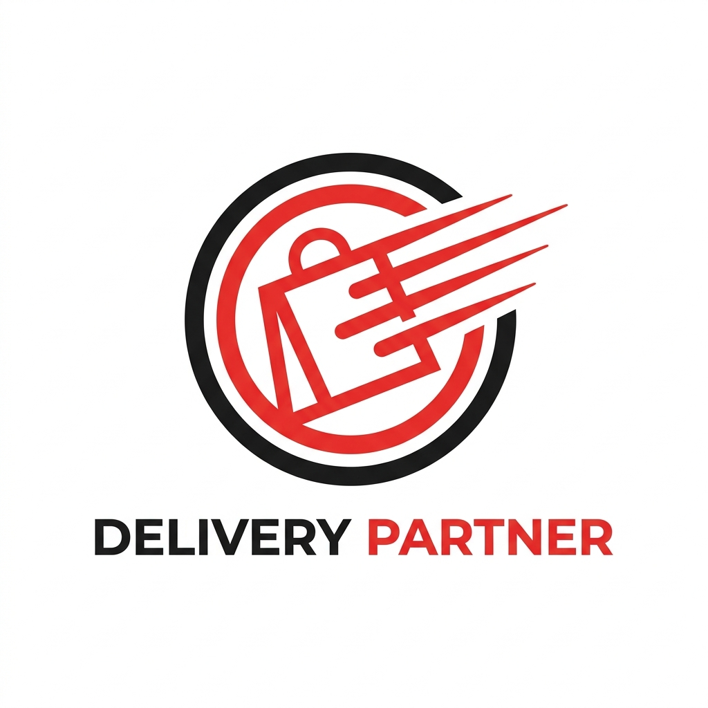
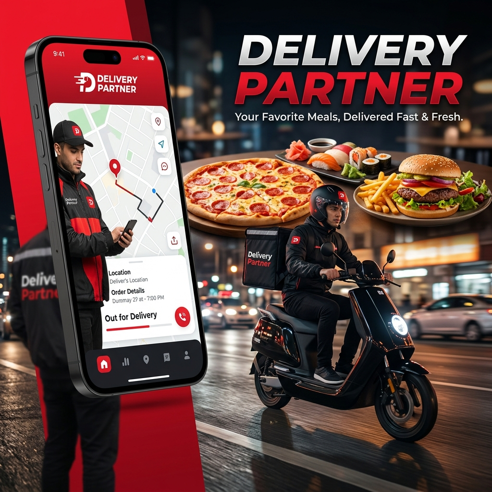

#  Delivery Partner

[](https://www.djangoproject.com/)
[](https://reactjs.org/)
[](https://vitejs.dev/)
[](https://www.sqlite.org/)
[](https://jwt.io/)



## 🌟 Overview

**Delivery Partner** is a premium, high-performance food delivery ecosystem designed to bridge the gap between customers, restaurants, and delivery heroes. Built with a robust **Django REST Framework** backend and a cutting-edge **React 19** frontend, it offers a seamless, real-time experience that sets a new standard for delivery platforms.

---

## 🚀 Key Innovations

### ⚡ Real-Time Synchronization
Our re-engineered sync engine uses high-frequency polling (5s intervals) to ensure that every order status change is communicated instantly across all dashboards. No more waiting—Vendors and Riders stay perfectly in sync.

### 🎨 Premium UI/UX Design
Experience a state-of-the-art interface featuring:
- **Glassmorphism** and soft shadows for a modern, tactile feel.
- **Dynamic Micro-animations** for intuitive feedback.
- **Responsive Layouts** refined for everything from wide desktops to mobile riders.
- **Custom-built Design System** ensuring visual consistency across 20+ unique pages.

### 🍱 Diverse Restaurant Ecosystem
Pre-loaded with a unique collection of "Cyberpunk Wok Fusion," "Neon Slice Pizzeria," and more, showcasing deep category management and complex menu hierarchies.

---

## 🛠️ Tech Stack & Architecture

| Layer | Technologies |
| :--- | :--- |
| **Frontend** | React 19, Vite, React Router 7, Axios, React Toastify, Lucide Icons |
| **Backend** | Django 5.1, Django REST Framework, SimpleJWT, SQLite, drf-spectacular |
| **Security** | Role-Based Access Control (RBAC), JWT Authentication, Protected Routes |
| **Docs** | Swagger UI, ReDoc, OpenAPI 3.0 |

---

## 📦 Project Structure

```bash
├── 📂 backend/               # Django Powerhouse
│   ├── 🐍 delivery_backend/    # Settings & Root URLs
│   ├── 👤 users/              # RBAC, Profiles, JWT
│   ├── 🍴 restaurants/        # Menus & Vendor Logic
│   └── 📦 orders/             # Order Lifecycle Engine
├── 📂 frontend/              # React Masterpiece
│   ├── 💻 src/
│   │   ├── 🌍 api/            # Centralized Axios Interceptors
│   │   ├── 🧠 context/        # Global Auth & State
│   │   └── 📄 pages/          # 20+ Dynamic Routes
└── 📂 assets/                # Visual Branding
```

---

## 🔑 Demo Credentials

| Role | Username | Password |
| :--- | :--- | :--- |
| **👑 Admin** | `admin` | `admin123456` |
| **🏪 Vendor** | `vendor_spice` | `vendor123456` |
| **🛵 Delivery** | `delivery_ravi` | `delivery123456` |
| **👤 Customer** | `customer_alice` | `customer123456` |

---

## ⚡ Quick Start

### 🏁 Backend Setup
1. `cd Delivery/backend`
2. `pip install -r requirements.txt`
3. `python manage.py migrate`
4. `python manage.py load_dummy_data`
5. `python manage.py runserver`

### 💻 Frontend Setup
1. `cd Delivery/frontend`
2. `npm install`
3. `npm run dev`

---

## 📚 API Exploration
Explore our robust API documentation at:
- **Swagger:** `http://localhost:8000/api/docs/`
- **ReDoc:** `http://localhost:8000/api/redoc/`

---

Built with ❤️ by **Delivery Partner Team**
